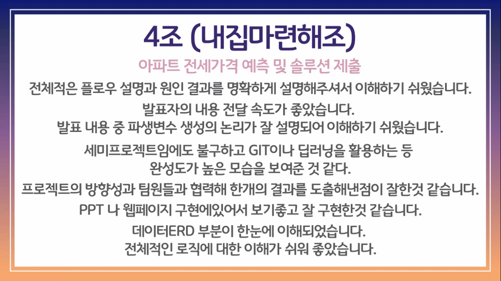
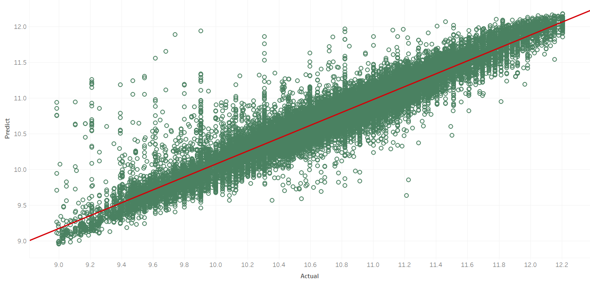

 내집마련해조 

 

## 소개 및 기획 배경

 서울시 아파트의 전세가를 예측하고 적정가를 알려주는 서비스입니다.  
 이 서비스를 이용한다면 전세 거래를 진행하기 전에 적당한 전세가를 미리 조회할 수 있기 때문에 전세사기를 방지할 수 있습니다. 또한, 아직 완공되지 않은 아파트의 미래 전세 가격도 예측할 수 있기 때문에, 자금을 구하거나 만기일을 설정하는 등의 금융 라이프를 설계하는 데 도움을 줄 수 있습니다.

 

## 사용 방법

UX를 극대화하기 위해 심플하면서 편안한 디자인으로 구성했다.  
사용자가 처음 맞이하는 홈 화면은 좌측이다. 예측하기를 누른 후, 궁금한 아파트 전세 조건을 입력하기만 하면, 우측처럼 예측한 전세가를 사용자에게 보여주는 간단한 구성으로 만들어졌다.

 

## 팀 소개
<!-- 
**팀 장 : 장 진 형**  
  

**팀 원 : 최 성 림**  
  

**팀 원 : 이 서 은**  
  

**팀 원 : 민 지 현**  
  

**팀 원 : 이 성 은**  
  -->
 

 

## 수상

 

## 사용 데이터

| 데이터 명  | 데이터 출처  |
|---|---|
| 행정동법정동코드 | 행정안전부 |
| 아파트 전월세 실거래가 | 국토교통부 |
| 서울시 아파트 정보  | 서울 열린 데이터 광장   |
| 아파트 정보  | 네이버 부동산 크롤링  |
| 동별 대형할인마트 수  | 4대 대형마트 홈페이지 크롤링  |
| 서울시 상권분석 서비스(집객시설-행정동)  | 서울 열린 데이터 광장   |
| RealEstate with distance  |  공공데이터포털 및 서울 열린 데이터 광장 |
| 한국은행금리  | 한국 은행 경제 통계 시스템  |
| 서울시 아파트별 도시공원  | 산림빅데이터 거래소  |

#### ER-Diagram

 

## 모델 구성

Scikit-learn의 HistGradientBoosting Regressor와 XGBRegressor 그리고 LGBMRegressor모델을 각각 최적화시키고 Voting으로 앙상블 했다.  
최종 모델의 성능은 91% 이었다.

 

## 기술 스택 및 시스템 아키텍처

 

## 시연 영상 
<iframe src="https://drive.google.com/file/d/1-tT4cGCTWbgnKv5EA8Zp2VV1hsXBA_1D/preview" width="640" height="480" allow="autoplay"></iframe>

